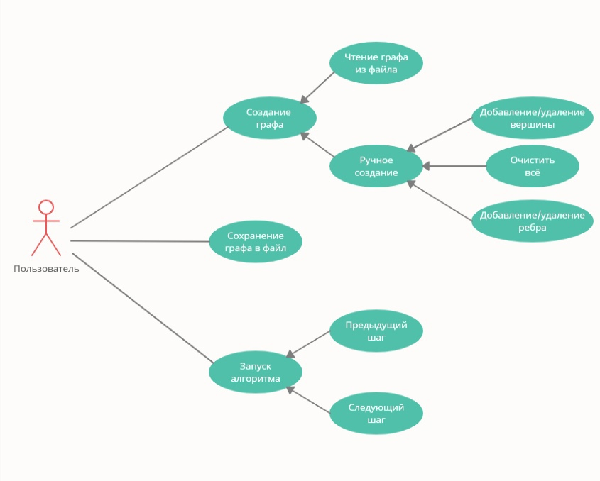
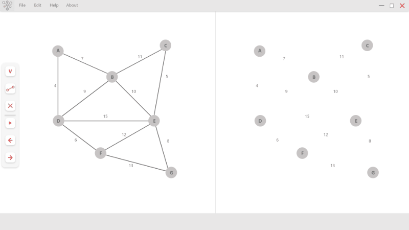

# 
# **Summer Practise (Летняя практика)**

**Репозиторий для летней практики 2021**

## **Спецификация:**

### **Описание задачи:**

Визуализация работы алгоритма построения минимального остовного дерева (Алгоритм Борувки).

## **Описание алгоритма**
**Алгоритм состоит из нескольких шагов:**

1. Изначально каждая вершина графа $\mathbb{G}$.— тривиальное дерево, а ребра не принадлежат никакому дереву.
  
2. Для каждого дерева T найдем минимальное инцидентное ему ребро. Добавим все такие ребра.

3. Повторяем шаг 2 пока в графе не останется только одно дерево $\mathbb{T}$.

  
Данный алгоритм может работать неправильно, если в графе есть ребра равные по весу. Например, полный граф из трех вершин, вес каждого ребра равен один. В T могут быть добавлены все три ребра. Избежать эту проблему можно, например, выбирая в первом пункте среди ребер, равных по весу, ребро с наименьшим номером.

### **Визуализация работы алгоритма**

  
## **План разработки**

### **План выполенния**

...

### **Информация по ведению проекта**

...
